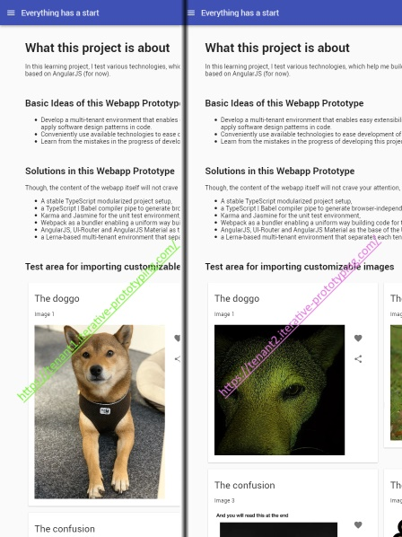

# edu.schwabe.multi-tenancy-webapp

This project contains a customizable `base-app` and two example tenant apps in `apps/*`. They showcase how to set up a mono repository for multiple tenant apps.

Additionally, the continuous deployment of each tenant app is also showcased:

- Pull requests are build and deployed to a temporary ´test´ environment, f.e. [tenant1 of PR-23](https://iterative-prototyping.com/PR-23/tenant1/) or [tenant2 of PR-23](https://iterative-prototyping.com/PR-23/tenant1/).

- The master branch is build and deployed to the `staging` environment for every pull request merged into that branch, i.e. [tenant1 on staging](https://staging.iterative-prototyping.com/tenant1/) or [tenant2 on staging](https://staging.iterative-prototyping.com/tenant2/).

- Deployment to a `productive` environment must be triggered manually: [tenant1 on productive](https://tenant1.iterative-prototyping.com/) or [tenant2 on productive](https://tenant2.iterative-prototyping.com/)

The project shall serve as a kind of a blueprint that can be used by other software developers to have a fully functional mono repository from start without dealing with most of the many annoying hassles while setting it up.

## Install

Set up all packages with `npm i` at the repository root only. The `postinstall` script in the package.json at the repository root invokes `lerna bootstrap` that sets up the child packages in `libs/*` and `apps/*` for you automatically.

Invoking `npm i` in any of the child packages' directories will remove the soft links in `node_modules` between the child packages so that they cannot use each other as dependencies anymore. In that case run `npm i` at the repository root and all should be fine again.

## How to Use

General available package.json scripts are:

- Lint and "auto-fix" all sources with `npm run lint`.

- Generate TypeDocs of all sources into `docs/` with `npm run docs`. You can browse the output in `docs/` with `npm run docs:serve`.

The package.json scripts `*:ci` are actually for the Bitbucket or Jenkins build pipeline, but of course are useful for you as well:

- Build all tenant apps with `npm run build:ci`.

- Run unit tests of child packages (i.e. `libs/*` and `apps/*`) with `npm run test:ci`.

- Clean up temporary build resources with `npm run clean:ci`.

## Tenancy

As mentioned, the mono repository contains a customizable `base-app` in `libs/` and the actual tenant apps in `apps/*`. The tenant apps depend on the base-app and can extend its functionality by f.e. adding new AngularJS modules, decorate existing AngularJS modules the AngularJS-way and add new ui-router states. Tenant apps can also add to well defined extension points in the base-app:

- Add entries to the navigation in the side-menubar with `NavigationService.forState`.

- Add access control guard services to the list `StateAccessControlService.guards`.

The functionality is IMHO already way to complex to be a good blueprint example. In that sense, please do not understand the app as a blueprint for the next cool looking freaking most modern app that vastly improves every ones life.

Furthermore, lerna, webpack and the repo's build scripts manage the bundling of each tenant app independently and enable the following customizations at build time:

- Replace or rather override static assets like images or translation files of the base-app by placing a variant at the same relative path in `apps/<name of tenant>/src/**/*` as the original is placed in `libs/base-app/src/**/*`. For example, `apps/tenant1/src/assets/example.jpg` overrides `libs/base-app/src/assets/example.jpg` for only `tenant1`.

- Override base-app's SCSS variables by setting them in `apps/<name of tenant>/src/scss/shared/_variables.scss`. Note that the base-app follows a component oriented organization: Each AngularJS-module can import its own SCSS root file. To enable variable overrides, `_variables.scss` is hence injected at the beginning of each such SCSS root file during build time. The tenancy in this project is not designed to enable any other manipulation of SCSS or the rendered CSS. Though, `angular-material` still provides a theming system that is worth to mention here, although this project does not make use of it for now.

### How to Use one Tenant

Start a tenant with `npx lerna run start --stream --scope */<package.json name of tenant>`, f.e. `npx lerna run start --stream --scope */*tenant1` or even `npx lerna run start --stream --scope */*1`.

- The asterisks behave like usual wildcards for lerna's `--scope`.
- `--stream` is for immediately see the output of the scripts.
- Hint: `--no-prefix` removes the ugly prefix that is the long package.json name of the tenant for each line that is printed to stdout.

Build a tenant into its `apps/<folder name of tenant>/dist/` with `npx lerna run build --stream --scope */<package.json name of tenant>`.

Browse a tenant's `dist/` with `npx lerna run build:serve --stream --scope */<package.json name of tenant>`.

Run and watch unit tests of a tenant with `npx lerna run test --stream --scope */<package.json name of tenant>` or `npx lerna run test:debug --stream --scope */<package.json name of tenant>`.

## What to Learn from this Project

The development of this project took me about 3-4 months (probably more) work time, which includes the Bitbucket and Jenkins pipeline, unit tests, high test coverage, set up of a good tool chain for maintaining clean build scripts code and clean app code. The whole set up went through many cycles of changing the setup over and over again. I am quite happy with the current results now and hope it will help others finding a good setup for their tenancy based projects.

Although the setup is using AngularJS, it can surely be adapted to contain React, Angular, VueJS or ES6+ tenancy apps as well. For mono repositories containing Angular apps, I would rather recommend using [nrwl/nx](https://github.com/nrwl/nx). It is a little bit more powerful than lerna and integrates well with the "set up, maintaining and extending the app via CLI" approach of Angular.

However, there are some learnings that you cannot copy & paste from this project. I recommend and invite you trying to start from scratch by yourself and walk your own training path in this regard. It always starts relatively simple with less complexity. As soon as you add tenancy and still want to have development features like maintaining SCSS variables between the shared code base and the actual tenant apps, the complexity of the setup will increase very fast.

Get used to it. Do not underestimate efforts for potentially changing already existing parts in your project just because adding new things seems so easy. Ignoring that you build up a lot of technical debts over time will hit you back with likely even worse extra efforts in the average case later.

## Credits

Credits go out to all the software developers of the many projects that actually make the world of a software developer a little bit easier day by day. There are many big projects like lerna or webpack but also many little projects like ngtemplate-loader, material-icons, etc, which would all deserve to be mentioned. However, I do not want to maintain a second dependency list here, so please have a look at the package.json files. All dependencies turned out to be pleasantly useful.
